# Install

In the folder containing `setup.py`, run
```
pip install --user -e .
```
The `--user` option ensures the library will only be installed for your user.
The `-e` option makes it possible to modify the library, and modifications will be loaded on the fly.

You should now be able to use it.

# Testing the Code

Some simple examples of how to use the code can be found in `examples`. Here you can see the switch from the Adam optimizer to the Vadam optimizer called on the same model.

# Reproducing UCI Experiments

The code for the UCI experiments together with obtained results can be found in `uci_code`. Using these results you should be able to reproduce these figures:


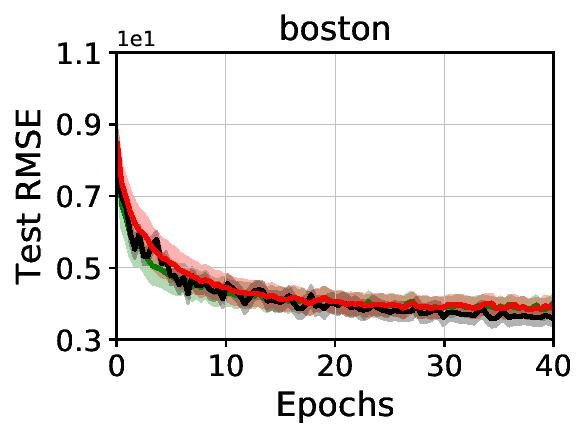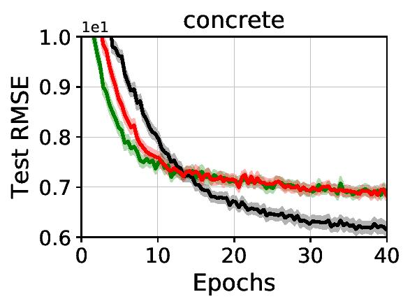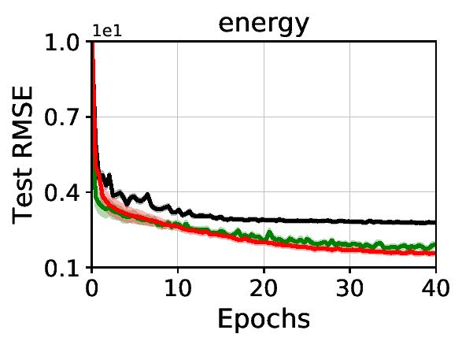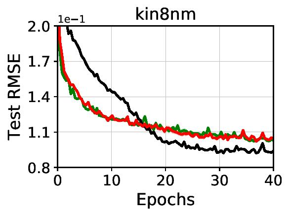

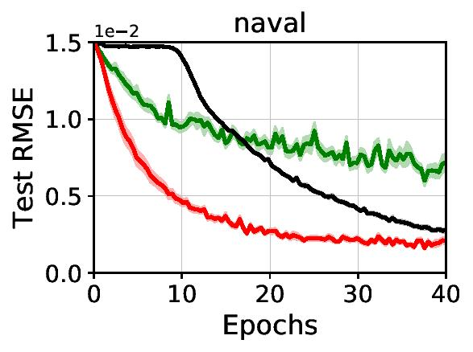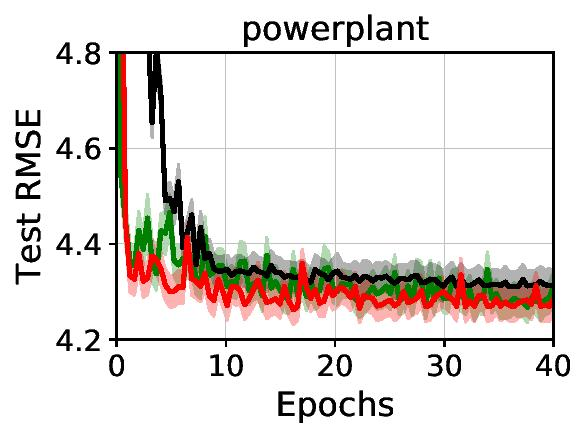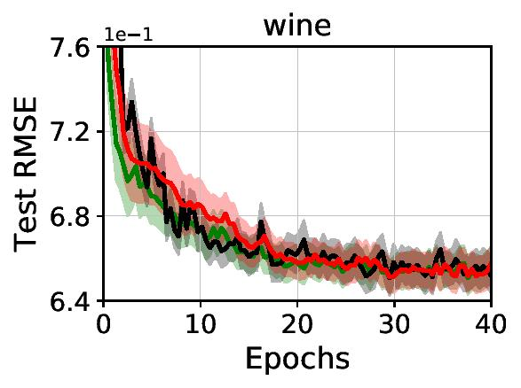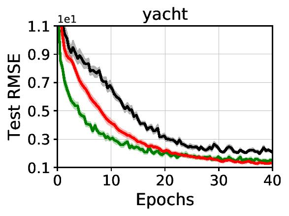

# Reproducing VOGN Experiments

The code for the VOGN experiments together with obtained results can be found in `vogn_code`. Using these results you should be able to reproduce these figures:

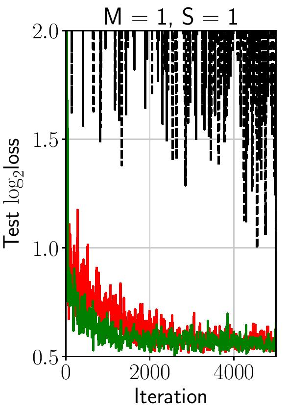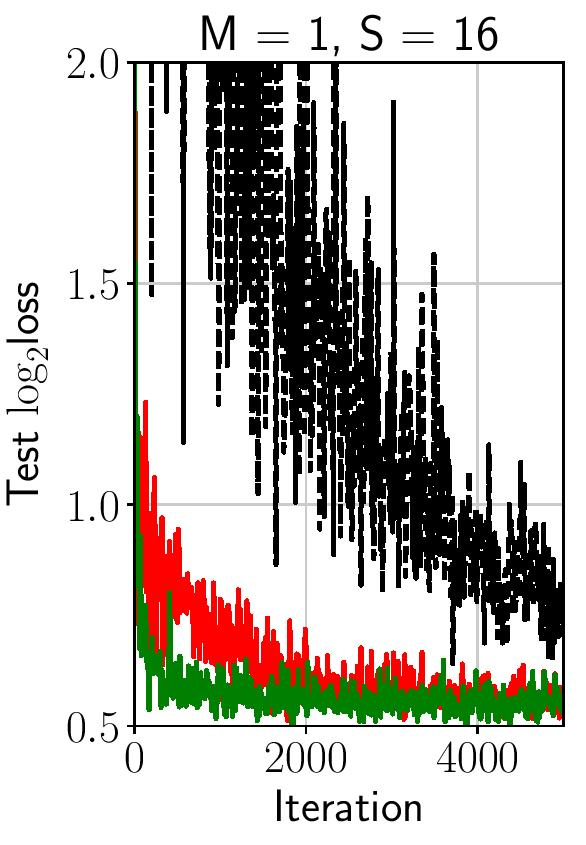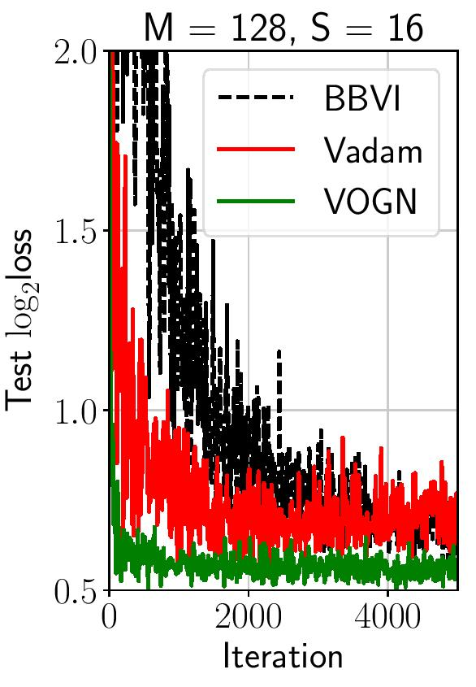

# MNIST Experiments

Code for MNIST experiments (not in the paper) together with obtained results can be found in `mnist_code`. These additional experiments show performance and convergence speed of Vadam compared to BBVI+Adam on various on MNIST. Here is an excerpt of the results, showing convergence for the two algorithms for different prior precisions, which is also used as the initial precision for the variational distribution:

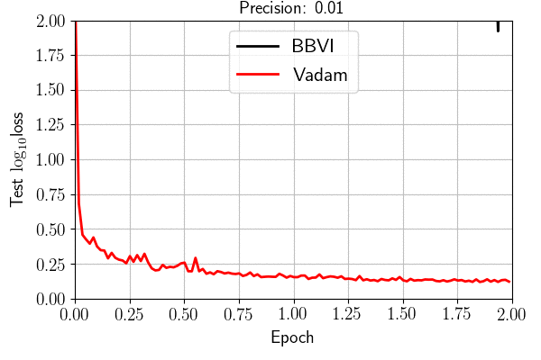
